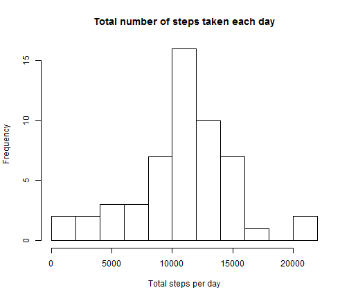
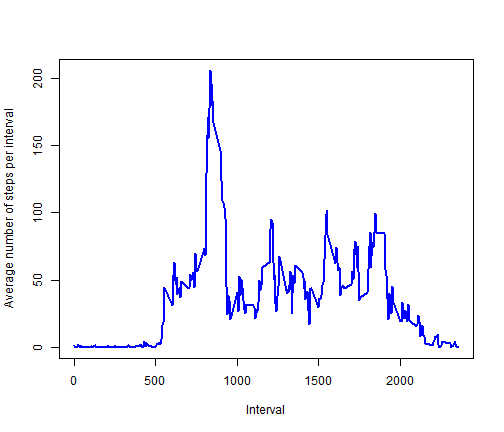
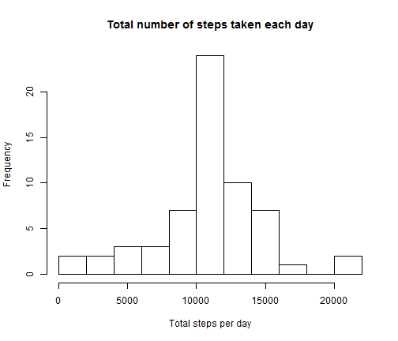
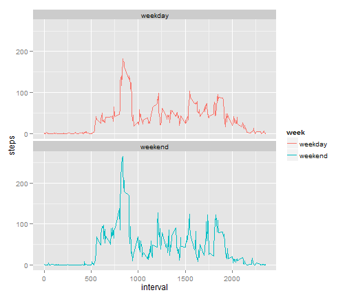

# Peer Assessment 1

## Introduction

It is now possible to collect a large amount of data about personal movement using activity monitoring devices such as a Fitbit, Nike Fuelband, or Jawbone Up. These type of devices are part of the "quantified self" movement - a group of enthusiasts who take measurements about themselves regularly to improve their health, to find patterns in their behavior, or because they are tech geeks. But these data remain under-utilized both because the raw data are hard to obtain and there is a lack of statistical methods and software for processing and interpreting the data.

This assignment makes use of data from a personal activity monitoring device. This device collects data at 5 minute intervals through out the day. The data consists of two months of data from an anonymous individual collected during the months of October and November, 2012 and include the number of steps taken in 5 minute intervals each day.
## Data

The data for this assignment can be downloaded from the course web site:

* Dataset: Activity monitoring data [52K]
The variables included in this dataset are:

* steps: Number of steps taking in a 5-minute interval (missing values are coded as NA)

* date: The date on which the measurement was taken in YYYY-MM-DD format

* interval: Identifier for the 5-minute interval in which measurement was taken

The dataset is stored in a comma-separated-value (CSV) file and there are a total of 17,568 observations in this dataset.

## Assignment

### Loading and preprocessing the data

Show any code that is needed to

1. Load the data (i.e. read.csv())

2. Process/transform the data (if necessary) into a format suitable for your analysis


```r
# Set the working director to the one containing the unzipped "activity.csv" file
setwd("D:/2014/Learn/Reproducible Research/Week 2")
data <- read.csv("activity.csv")
head(data, n=3)
```

```
##   steps       date interval
## 1    NA 2012-10-01        0
## 2    NA 2012-10-01        5
## 3    NA 2012-10-01       10
```

```r
tail(data, n=3)
```

```
##       steps       date interval
## 17566    NA 2012-11-30     2345
## 17567    NA 2012-11-30     2350
## 17568    NA 2012-11-30     2355
```

### What is mean total number of steps taken per day?

For this part of the assignment, you can ignore the missing values in the dataset.

* Make a histogram of the total number of steps taken each day


```r
hist(tapply(data$steps, data$date, sum), breaks = 10, xlab = "Total steps per day", main = "Total number of steps taken each day")
```

 

* Calculate and report the mean and median total number of steps taken per day


```r
total.steps.daily <- tapply(data$steps, data$date, sum)
mean.steps.daily <- mean(total.steps.daily, na.rm = TRUE)
median.steps.daily <- median(total.steps.daily, na.rm = TRUE)
mean.steps.daily
```

```
## [1] 10766
```

```r
median.steps.daily
```

```
## [1] 10765
```

### What is the average daily activity pattern?

* Make a time series plot (i.e. type = "l") of the 5-minute interval (x-axis) and the average number of steps taken, averaged across all days (y-axis)


```r
library(plyr)
interval.data <- ddply(data, .(interval), summarize, steps = mean(steps, na.rm=TRUE))
head(interval.data, n=3)
```

```
##   interval  steps
## 1        0 1.7170
## 2        5 0.3396
## 3       10 0.1321
```

```r
tail(interval.data, n=3)
```

```
##     interval  steps
## 286     2345 0.6415
## 287     2350 0.2264
## 288     2355 1.0755
```

```r
plot(interval.data$interval, interval.data$steps, ylab="Average number of steps per interval",xlab="Interval", main=NULL, type="l", lwd=2, col="blue")
```

 

* Which 5-minute interval, on average across all the days in the dataset, contains the maximum number of steps?


```r
max.steps <- max(interval.data$steps)
max.interval <- interval.data[interval.data$steps == max.steps, 1]
max.interval
```

```
## [1] 835
```

### Imputing missing values

Note that there are a number of days/intervals where there are missing values (coded as NA). The presence of missing days may introduce bias into some calculations or summaries of the data.

* Calculate and report the total number of missing values in the dataset (i.e. the total number of rows with NAs)


```r
dim(data[is.na(data$steps), ])[1]
```

```
## [1] 2304
```

* Devise a strategy for filling in all of the missing values in the dataset. The strategy does not need to be sophisticated. For example, you could use the mean/median for that day, or the mean for that 5-minute interval, etc.

The strategy is to replace the NA values with the average number of steps taken, averaged across all days for each 5-minute interval, as calculated earlier.

* Create a new dataset that is equal to the original dataset but with the missing data filled in.


```r
# Create of copy of data
new.data <- data
# Create of vector of missing steps
miss <- which(is.na(new.data$steps))
# Replace NA values with avrage number of steps for each 5-minute interval
new.data[miss,1] <- interval.data[as.factor(new.data[miss,3]),2]
head(new.data, n=3)
```

```
##    steps       date interval
## 1 1.7170 2012-10-01        0
## 2 0.3396 2012-10-01        5
## 3 0.1321 2012-10-01       10
```

```r
tail(new.data, n=3)
```

```
##        steps       date interval
## 17566 0.6415 2012-11-30     2345
## 17567 0.2264 2012-11-30     2350
## 17568 1.0755 2012-11-30     2355
```

* Make a histogram of the total number of steps taken each day and Calculate and report the mean and median total number of steps taken per day. 


```r
new.total.steps.daily <- tapply(new.data$steps, new.data$date, sum)
hist(new.total.steps.daily, breaks = 10, xlab = "Total steps per day", main = "Total number of steps taken each day")
```

 

```r
new.mean.steps.daily <- mean(new.total.steps.daily, na.rm = TRUE)
new.median.steps.daily <- median(new.total.steps.daily, na.rm = TRUE)
new.mean.steps.daily
```

```
## [1] 10766
```

```r
new.median.steps.daily
```

```
## [1] 10766
```

* Do these values differ from the estimates from the first part of the assignment?


```r
mean.steps.daily
```

```
## [1] 10766
```

```r
new.mean.steps.daily 
```

```
## [1] 10766
```

```r
median.steps.daily
```

```
## [1] 10765
```

```r
new.median.steps.daily
```

```
## [1] 10766
```

Both the means are same, that is, 10766.
The new median is 10766, compared to the earlier one of 10755.

* What is the impact of imputing missing data on the estimates of the total daily number of steps?


```r
count(is.na(total.steps.daily))
```

```
##       x freq
## 1 FALSE   53
## 2  TRUE    8
```

```r
count(is.na(new.total.steps.daily))
```

```
##       x freq
## 1 FALSE   61
```

The earlier total daily number of steps had 8 missings values, while the new one has none missing.

### Are there differences in activity patterns between weekdays and weekends?

For this part the weekdays() function may be of some help here. Use the dataset with the filled-in missing values for this part.

* Create a new factor variable in the dataset with two levels - "weekday" and "weekend" indicating whether a given date is a weekday or weekend day.


```r
new.data$day <- weekdays(as.Date(new.data$date))
head(new.data, n=3)
```

```
##    steps       date interval    day
## 1 1.7170 2012-10-01        0 Monday
## 2 0.3396 2012-10-01        5 Monday
## 3 0.1321 2012-10-01       10 Monday
```

```r
tail(new.data, n=3)
```

```
##        steps       date interval    day
## 17566 0.6415 2012-11-30     2345 Friday
## 17567 0.2264 2012-11-30     2350 Friday
## 17568 1.0755 2012-11-30     2355 Friday
```

```r
d <- levels(factor(new.data$day))
new.data$week <- "weekday"
new.data[new.data$day==d[1],5]<-"weekend"
new.data[new.data$day==d[7],5]<-"weekend"
new.data$week <- as.factor(new.data$week)
summary(new.data$week)
```

```
## weekday weekend 
##   12384    5184
```

* Make a panel plot containing a time series plot (i.e. type = "l") of the 5-minute interval (x-axis) and the average number of steps taken, averaged across all weekday days or weekend days (y-axis). 


```r
library(plyr)
interval.data.weekdays <- ddply(new.data, .(interval, week), summarize, steps = mean(steps, na.rm=TRUE))
head(interval.data.weekdays, n=3)
```

```
##   interval    week   steps
## 1        0 weekday 1.52523
## 2        0 weekend 2.17505
## 3        5 weekday 0.03949
```

```r
tail(interval.data.weekdays, n=3)
```

```
##     interval    week  steps
## 574     2350 weekend 0.4822
## 575     2355 weekday 0.5902
## 576     2355 weekend 2.2348
```

```r
library(ggplot2)
ggplot(data=interval.data.weekdays, aes(x=interval, y=steps, group=week)) + geom_line(aes(color=week))+ facet_wrap(~ week, nrow=2)
```

 
